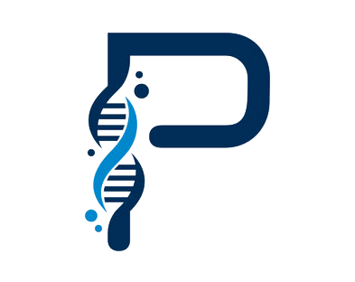
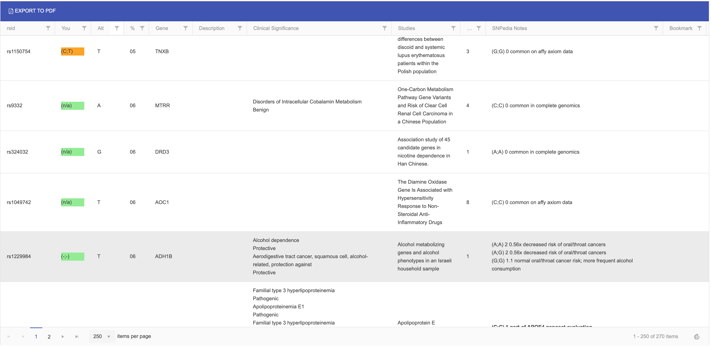
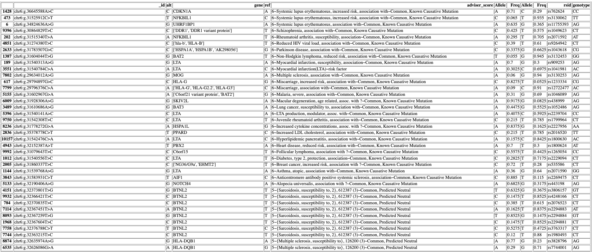

# Phenotype

<p align="center">
  
</p>

<p align="center">
  <a href="#quick-start"></a>
  <a href="#what-it-does"></a>
  <a href="#vep-workflow"></a>
</p>

<p align="center">
  
</p>

Phenotype is a local genome annotation app for inspecting SNPs without pushing raw genotype data to a hosted service. It combines imported genotypes with cached sources such as ClinVar, SNPedia, VEP, and Promethease-style reports.

## What It Does

- Upload a 23andMe or Ancestry-style genome file.
- Review `Findings`, `New`, `Clinical`, `All annotated`, `Unannotated`, and `Build 37 variants`.
- Search by rsid or gene.
- Filter by zygosity, VEP impact, VEP consequence, and finding severity.
- Sort by magnitude, rating, recency, publication count, gene, rsid, and frequency.
- Open a SNP in the sidebar to see linked studies, SNPedia, ClinVar, and metadata.
- Import VEP output, ClinVar data, and Promethease HTML reports.
- Export VEP input for build 37 variants or rsid lists.

## Why It Feels Fast

- The table is summary-first.
- Full SNP detail loads only when you click a row.
- Summary counts and the default findings view are cached locally.
- Matching is stricter: rows only show as findings when the imported genotype actually matches.

## Screenshot

<p align="center">
  
</p>

## Quick Start

```bash
python3 -m venv .venv
source .venv/bin/activate
python -m pip install --upgrade pip
python -m pip install -e ".[dev]"
```

Run the app:

```bash
cd src/phenotype-web
../../.venv/bin/python -m flask --app phenotype.app:create_app run --host 127.0.0.1 --port 5000
```

Open the local URL printed by Flask. If `5000` is busy, use another free port.

Local data lives under `src/phenotype-web/data/`:

- `scrapedData.json` for cached annotations
- `yourData.json` for imported genotypes
- `phenotype.sqlite` for the local cache

## Importing Data

### Genome file

Use the browser upload or run the importer directly:

```bash
cd src/phenotype-web
../../.venv/bin/python -m phenotype.scraper
```

### Promethease HTML report

Import a Promethease-style HTML report from the browser to seed the cache with existing findings.

### ClinVar and VEP

The browser supports:

- `Import ClinVar DB`
- `Scan x;y ClinVar matches`
- `Import VEP`
- `Import report HTML`
- `Refresh finding dates`
- `Refresh annotations`

## VEP Workflow

After importing a build 37 genome file, use `Build 37 variants` with `x;y` to narrow the export to heterozygous rows.

Install the GRCh37 cache:

```bash
mkdir -p "$HOME/vep_data"
docker run -t -i -v "$HOME/vep_data:/data" ensemblorg/ensembl-vep INSTALL.pl -a cf -s homo_sapiens -y GRCh37
```

Run VEP on the exported build 37 variants:

```bash
docker run --rm \
  -v "$HOME/vep_data:/data" \
  -v "$PWD/src/phenotype-web/data/exports:/work" \
  ensemblorg/ensembl-vep \
  vep --cache --offline --assembly GRCh37 --format ensembl \
  --input_file /work/phenotype_build37_heterozygous_vep_input.tsv \
  --output_file /work/phenotype_vep_output.txt \
  --force_overwrite --tab --symbol --hgvs --canonical --variant_class --no_stats
```

Import the result:

```bash
.venv/bin/phenotype-vep-import src/phenotype-web/data/exports/phenotype_vep_output.txt
```

## API

- `GET /api/snps`
- `GET /api/snps/<rsid>`
- `GET /api/variants`
- `GET /api/backlog`
- `POST /api/import`
- `POST /api/report/import`
- `POST /api/scrape`
- `POST /api/scrape/resume`
- `POST /api/refresh-findings`
- `POST /api/vep/import`
- `GET /api/scrape-runs/latest`
- `GET /api/scrape-runs/<run_id>`
- `GET /api/export.csv`
- `GET /api/export-vep.tsv`
- `GET /api/export-vep-rsids.txt`
- `DELETE /api/genotypes`

## Development

```bash
.venv/bin/python -m pytest
.venv/bin/python -m ruff check src/phenotype-web/phenotype tests
.venv/bin/python -m ruff format src/phenotype-web/phenotype tests
```

## Notes

- The app is for personal exploration, not diagnosis.
- Direct-to-consumer raw data can contain false positives.
- Clinical interpretation should be confirmed with an appropriate lab test and a clinician.

